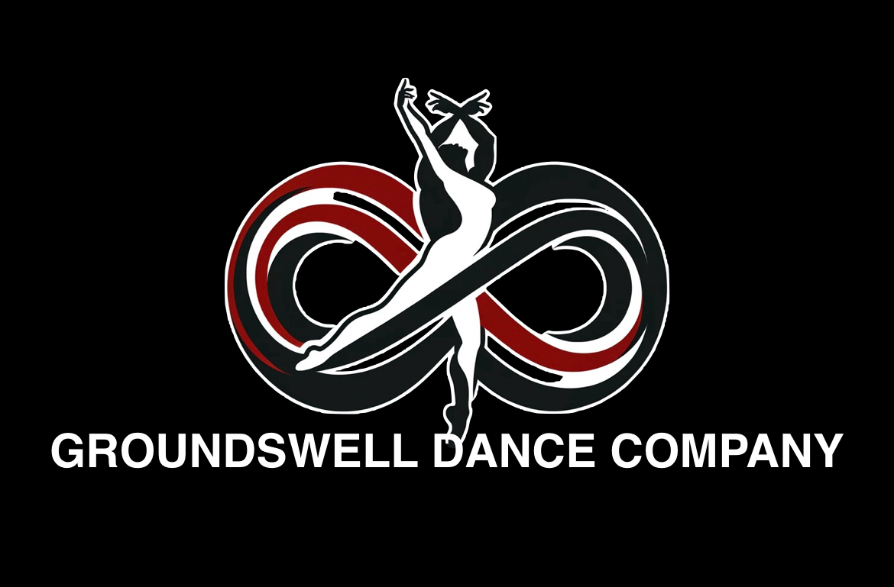

# Groundswell Dance Company Portal

Welcome to the official **Groundswell Dance Company** training portal — a custom web app for students and teachers to set goals, track progress, upload training videos, and earn digital badges.



## Features

- **Secure student login and registration**
- **Teacher dashboard** with goal templates and feedback tools
- **Student goal setting** (Technique, Strength, Flexibility, Performance)
- **Video uploads** linked to goals
- **Streak tracker** and **badges**
- Password reset system
- Local JSON file storage

## Getting Started

### Installation

1. Clone this repo or download the ZIP.
2. Navigate into the folder:
   ```bash
   cd groundswell-dance-portal
   ```
3. Install dependencies:
   ```bash
   pip install streamlit
   ```

4. Run the app:
   ```bash
   streamlit run app.py
   ```

### Folder Structure

- `app.py` — Main Streamlit app
- `groundswell_logo.jpg` — Your branded logo
- `user_db.json`, `user_goals.json`, etc. — Data storage
- `videos/` — Uploaded student videos

### Deployment

You can deploy this using [Streamlit Cloud](https://streamlit.io/cloud) in minutes:
1. Push this repo to GitHub
2. Go to Streamlit Cloud and connect your GitHub
3. Select `app.py` and click **Deploy**

## License

This project is licensed under the MIT License — see `LICENSE` for details.
